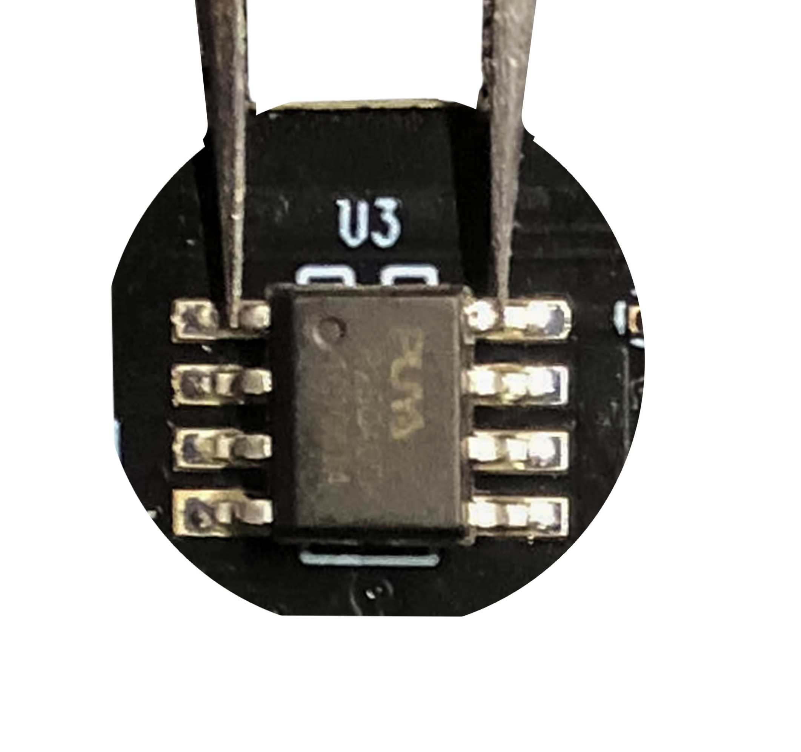

# ☂️ Umbrel OS - Fix RTL9210

Step-by-step to fix and optimize Enclosures with chipsets RTL9210 and RTL9210B in Umbrel OS (Raspberry Pi). Solving unexpected disconnections for your NVMe/SATA SSD caused by suspension mode for this esclosures with default firmware version.

> [!TIP]
> _All procedures described in this Git repository are at your own risk. In case of software issues, you can find some solutions in the [Unbrick](#unbrick) section._

Recommended try this first: https://github.com/getumbrel/umbrel/issues/2139#issuecomment-4416300158

---

### Table of contents

- [Information](#information)
- [Step-by-step](#step-by-step)
- [Firmware download](#firmware-download)
- [Chipset list](#chipset-list)
- [Supported devices](#supported-devices)
- [Unbrick](#unbrick)
- [Firmware changelog](#firmware-changelog)
- [Sources](#sources)

### Files and folders

- [Configure](configure): All configurations for each device.
- [Dump](dump): All dumps for each device.
- [Firmware](firmware): All found firmware.

---

## Information

The problem is to run local server with Umbrel **☂️ Umbrel OS** (Raspberry Pi 4) using **External SSD enclosure** with chipsets **_RTL9210 and RTL9210B_** (Orico, Ugreen, and more). Many of enclosures contains old version of firmware, is unstable and bring problems in Umbrel OS system. So, try to use a enclosure with these chipsets, often cause message **_Refused connection_** in `https://umbrel.local` after some time. This occurs because the default firmware force the **_Sleep Mode/Enclosure suspension_** from time to time. When Umbrel OS try access and write disk finds device _sleeping_, doing to lock the _Docker_ and others services of Umbrel OS, repeating this cicle with every forced restart system.

### How to know this problem?

**Do this BEFORE updating the enclosure firmware:**

- Use the official Raspberry Pi 4 power supply (5.1V DC, 3.0A, 15.3W)
- Plug into the USB 3.0 (blue) port — required

If you to do all tests, and yet have the same problem, continue with step-by-step.

The solution is to _flash_ a new stable firmware version (**Recommended v1.32.49**) and inject a custom config file (.cfg), that permanently (until you return to default version) disables any power-saving features from the enclosure. This brings full availability of your SSD NVMe/SATA to your Umbrel OS (especially if you plan to run a Bitcoin Node).

---

## Step-by-step

- Required a computer running Windows

> [!CAUTION]
> Flashing the firmware can _BRICK_ or _PERMANENTLY DAMAGE_ your device. **Do it at your own risk**. The author of this Git repository is not responsible for any damage to your device. If you brick your device, you can try to unbrick it with the Unbrick section.  

> [!WARNING]
> The firmware update tool is **ONLY AVALIABLE FOR WINDOWS** and _does not work well on Linux with Wine or in a virtual machine_.

1. Download the **correct** and latest firmware with tools from the `firmware` folder.
2. Extract the archive.
3. Connect the device to the computer.
4. Launch the firmware update tool (such as UTHSB_MPtool) provided in the firmware archive.
5. Dump your device configuration with the firmware update tool and save it.
6. Disconnect the enclosure from the computer.
7. Remove the NVMe/SATA drive.
8. Reconnect the device to the computer.
9. Copy the configuration file (`.cfg`) of your device from the **configure folder** to the **configure folder** where the firmware update tool is located.
10. Change the `SERIAL` in the configuration file to match your dump file **if it is defined**. (Optional but recommended)
11. Comment out the `DISK_IPS_THRES` with a `;` in the configuration file. (Optional but recommended)
12. Launch the firmware update tool (such as UTHSB_MPtool) provided in the firmware archive.
13. Select the configuration file (`.cfg`) of your device.
14. Click on the flash/update device button and wait until the process is finished.

### Configuration

This section describes how to configure (in cfg files) the firmware for your device, all configurations are in the `configure` folder or use values from the `dump` folder to create your own configuration.

**Each configuration are unique to the device, your enclosure may not work properly if you have not the right configuration.**

| Variable name            | Value example        | Description                                                                                                   |
| :----------------------- | :------------------- | :------------------------------------------------------------------------------------------------------------ |
| U2PHY                    | 02 f4 9b e0 e1       | USB 2.0 Physical Layer settings                                                                               |
| U3PHY                    | 02 d4 09 00 d5 00 80 | USB 3.0 Physical Layer settings                                                                               |
| VID                      | 0x0bda               | Vendor ID                                                                                                     |
| PID                      | 0x9210               | Product ID                                                                                                    |
| MANUFACTURE              | "Unionsine"          | Manufacturer name                                                                                             |
| PRODUCT                  | "MD202"              | Product name                                                                                                  |
| SERIAL                   | "012345679545"       | Serial number, 12 characters and unique per device                                                            |
| SCSI_PRODUCT             | "Unionsine MD202 "   | SCSI Product name                                                                                             |
| SCSI_VENDOR              | "n/a"                | SCSI Vendor name                                                                                              |
| CFEXPRESS                | 0x0                  | Enable CFExpress card reader (Always 0x0)                                                                     |
| USB_SELF_PWR             | 0x0                  | If the device is self-powered ?                                                                               |
| LED                      | 0x1                  | Set to 0x1 if the device has a LED                                                                            |
| DISK_HOTPLUG             | 0x0                  | Anable device supports hot-plugging (Very often 0x0)                                                          |
| PINMUX1                  | 0x0                  | Pin multiplexing settings (first set)                                                                         |
| PINMUX2                  | 0x0                  | Pin multiplexing settings (second set)                                                                        |
| U2_MAXPWR                | 0xfa                 | USB 2.0 mode maximum power                                                                                    |
| U3_MAXPWR                | 0x70                 | USB 3.0 mode maximum power                                                                                    |
| ASPMDIS                  | 0x0                  | Enable or disable active power management                                                                     |
| PCIE_REFCLK              | 0x0                  | PCIe reference clock                                                                                          |
| PCIE_PWRCUT_THRES        | 0x5                  | Suspends the PCIe power after 5 minutes of idle time (1 unit = 1 minute), it recommended to comment this line |
| DISK_IPS_THRES           | 0x1                  | Responsible for powering down the PCI bus after a timeout to conserve energy                                  |
| SWR_1_2V                 | 0x0                  | ?                                                                                                             |
| EN_U1U2                  | 0x1                  | Set to 0x1 to enable USB 3.0 Link Power Management                                                            |
| EN_UPS                   | 0x1                  | Enable USB Power Saving ?                                                                                     |
| PD                       | 0x1                  | Power Down                                                                                                    |
| CUSTOMIZED_LED           | 02 01 07             | To customize the LED behavior                                                                                 |
| SUSPEND_LED_OFF          | 0x1                  | ?                                                                                                             |
| FORCE_USB_SPEED          | 0x0                  | Force specific USB speed ?                                                                                    |
| FORCE_PCIE_SPEED         | 0x0                  | Force specific PCIe speed ?                                                                                   |
| FORCE_USB_QUIRK          | 0x0                  | ?                                                                                                             |
| FORCE_PCIE_QUIRK         | 0x0                  | ?                                                                                                             |
| FAN                      | 0x0                  | Set to 0x1 if the device has a fan                                                                            |
| DIS_SHOW_EMPTY_DISK      | 0x1                  | Set to 0x1 to show the enclosure when no NVMe/SATA drive is connected                                         |
| FORCE_SATA_NORMAL_DMA    | 0x0                  | Force SATA to use normal DMA                                                                                  |
| RM_INTERNAL_RD           | 0x0                  | ?                                                                                                             |
| HS_AUTO_SWITCH           | 0x0                  | ?                                                                                                             |
| UART_DBG_PIN             | 0x0                  | UART Debug pin                                                                                                |
| UART_BAUD_RATE           | 0x0                  | UART Baud rate                                                                                                |
| FINGER_PRINT_EN          | 0x0                  | Enable fingerprint authentication                                                                             |
| CUSTOMIZED_DISK_IDENTIFY | 0x0                  | ?                                                                                                             |
| HW_LED_CFG               | 0x0                  | ?                                                                                                             |
| CDROM_CFG                | 0x0                  | ?                                                                                                             |
| SUPPORT_HID              | 0x0                  | ?                                                                                                             |
| LATE_INIT_DISK           | 0x0                  | ?                                                                                                             |
| SCSI_WP_PIN              | 0x0                  | Write Protect SCSI pin ?                                                                                      |
| SD_MMC_TYPE              | 0x0                  | ?                                                                                                             |
| FORCE_PORT_TYPE          | 0x0                  | ?                                                                                                             |
| BCDDEVICE                | 0x0                  | ?                                                                                                             |
| SUSPEND_DISK_OFF         | 0x7                  | ?                                                                                                             |
| SCSI_WB_PIN              | 0x0                  | ?                                                                                                             |
| CUSTOMIZED_FEATURE       | 0x0                  | ?                                                                                                             |
| PERIPH_API               | 0x0                  | ?                                                                                                             |
| RAID_CFG                 | 0x0                  | ?                                                                                                             |

### Create your own configuration

To create your own configuration, you can use the `dump` folder to get the values of your device.

1. Find the dump file of your device in the `dump` folder or on the internet.
2. Create a new file in the `configure` folder with the name of your device and the extension `.cfg`.
3. Copy the content of the dump file into the new file.
4. Remove the first 3 lines of the dump file. These lines start with a line of `*`, contain the device name on the second line, and have another line of `*` on the third line.
5. Remove variables with a value of `n/a`. (Optional)
6. Replace `:` with `=` for variable definitions.
7. Comment `DISK_IPS_THRES` by changing it to `;DISK_IPS_THRES = 0x1` if you want. (Optional)
8. Launch the firmware update tool (such as UTHSB_MPtool), select the new configuration file, and flash it.

---

## Firmware download

All versions already include an firmware update tool in `.zip` file.

| Firmware version     | RTL9201(A) | RTL9210(A) | RTL9210B | RTL9220A | Links                                                           |
| :------------------- | :--------- | :--------- | :------- | :------- | :-------------------------------------------------------------- |
| 1.34.39.032625       | ❓         | ❌         | ✅       | ❓       | [Download](firmware/realtek_rtl9210B_fw_1.34.39.zip)            |
| 1.34.29.011325       | ❓         | ❌         | ✅       | ❓       | [Download](firmware/realtek_rtl9210B_fw_1.34.29.zip)            |
| 1.33.98.090324       | ❓         | ❌         | ✅       | ❓       | [Download](firmware/realtek_rtl9210B_fw_1.33.98.090324.zip)     |
| 1.33.44.011824       | ❓         | ❓         | ✅       | ❓       | [Download](firmware/realtek_rtl9210B_fw_1.33.44.011824.zip)     |
| 1.33.7.191023        | ❓         | ❌         | ✅       | ❓       | [Download](firmware/realtek_rtl9210B_fw_1.33.7.191023.zip)      |
| 1.33.5.100623        | ❓         | ❓         | ✅       | ❓       | n/a                                                             |
| 1.32.901.120722      | ❓         | ❓         | ✅       | ❓       | [Download](firmware/realtek_rtl9210B_fw_1.32.901.120722.zip)    |
| 1.32.87.082923       | ❓         | ❓         | ✅       | ❓       | [Download](firmware/realtek_rtl9210B_fw_1.32.87.082923.zip)     |
| 1.32.68.062623       | ❓         | ❓         | ✅       | ❓       | [Download](firmware/realtek_rtl9210B_fw_1.32.68.062623.zip)     |
| 1.32.49.140423 (LCD) | ❓         | ❓         | ✅       | ❓       | [Download](firmware/realtek_rtl9210B_fw_1.32.49.140423_lcd.zip) |
| 1.32.49.140423       | ❓         | ❓         | ✅       | ❓       | [Download](firmware/realtek_rtl9210B_fw_1.32.49.140423.zip)     |
| 1.32.45.041323       | ❓         | ❓         | ✅       | ❓       | [Download](firmware/realtek_rtl9210B_fw_1.32.45.041323.zip)     |
| 1.32.16.010923       | ❓         | ❓         | ✅       | ❓       | [Download](firmware/realtek_rtl9210B_fw_1.32.16.010923.zip)     |
| 1.31.17.102022 (2)   | ❓         | ❓         | ✅       | ❓       | [Download](firmware/realtek_rtl9210B_fw_1.31.17.102022_2.zip)   |
| 1.31.17.102022       | ❓         | ❓         | ✅       | ❓       | [Download](firmware/realtek_rtl9210B_fw_1.31.17.102022.zip)     |
| 1.30.28.081022       | ❓         | ❓         | ✅       | ❓       | [Download](firmware/realtek_rtl9210B_fw_1.30.28.081022.zip)     |
| 1.30.24.030822       | ❓         | ❓         | ✅       | ❓       | [Download](firmware/realtek_rtl9210B_fw_1.30.24.030822.zip)     |
| 1.30.21.070622       | ❓         | ✅         | ✅       | ❓       | [Download](firmware/realtek_rtl9210AB_fw_1.30.21.070622.zip)    |
| 1.30.17              | ❓         | ❓         | ✅       | ❓       | [Download](firmware/realtek_rtl9210B_fw_1.30.17.zip)            |
| 1.29.391             | ❓         | ✅         | ❌       | ❓       | [Download](firmware/realtek_rtl9210_fw_1.29.391.zip)            |
| 1.29.12.011122       | ✅         | ❓         | ✅       | ❓       | [Download](firmware/realtek_rtl9210AB_fw_1.29.12.011122.zip)    |
| 1.29.12              | ❓         | ✅         | ❌       | ❌       | [Download](firmware/realtek_rtl9210_fw_1.29.12.zip)             |
| 1.29.8               | ❓         | ✅         | ❌       | ❌       | [Download](firmware/realtek_rtl9210_fw_1.29.8.zip)              |
| 1.28.17              | ❓         | ✅         | ❌       | ❌       | [Download](firmware/realtek_rtl9210_fw_1.28.17.zip)             |
| 1.27.25              | ❓         | ✅         | ❌       | ❌       | [Download](firmware/realtek_rtl9210_fw_1.27.25.zip)             |
| 1.27.24              | ❓         | ✅         | ❌       | ❌       | [Download](firmware/realtek_rtl9210_fw_1.27.24.zip)             |
| 1.25.18              | ❓         | ✅         | ❓       | ❌       | [Download](firmware/realtek_rtl9210_fw_1.25.18.zip)             |
| 1.25.14              | ❓         | ✅         | ❌       | ❌       | [Download](firmware/realtek_rtl9210_fw_1.25.14.zip)             |
| 1.25.7               | ❓         | ✅         | ❌       | ❌       | [Download](firmware/realtek_rtl9210_fw_1.25.7.zip)              |
| 1.24.2               | ❓         | ❓         | ✅       | ❓       | n/a                                                             |
| 1.23.15              | ❓         | ✅         | ❌       | ❌       | [Download](firmware/realtek_rtl9210_fw_1.23.15.zip)             |
| 1.23.9               | ❓         | ✅         | ❌       | ❌       | [Download](firmware/realtek_rtl9210_fw_1.23.9.zip)              |
| 1.23.5               | ❓         | ❓         | ❓       | ❌       | n/a                                                             |
| 1.20.12              | ❓         | ✅         | ❌       | ❌       | [Download](firmware/realtek_rtl9210_fw_1.20.12.zip)             |

## Chipset list

| Hardware    | USB          | PCIe/NVMe | SATA   | Others features                                                                                    |
| :---------- | :----------- | :-------- | :----- | :------------------------------------------------------------------------------------------------- |
| RTL9201(A)  | 3.x 10Gbps   | -         | SATA 3 | Many bugs                                                                                          |
| RTL9201R    | 3.x 10Gbps   | -         | SATA 3 |                                                                                                    |
| RTL9210(A)  | 3.x 10Gbps   | 3.0x2     | SATA 3 | Some enclosure only support NVMe or SATA                                                           |
| RTL9210VA   | 3.x 10Gbps   | 3.0x2     | SATA 3 |                                                                                                    |
| RTL9210B    | 3.x 10Gbps   | 3.0x2     | SATA 3 | [RTL9210B-CG](https://www.realtek.com/Product/Index?id=4075&cate_id=786)                           |
| RTL9210VB   | 3.x 10Gbps   | 3.0x2     | SATA 3 |                                                                                                    |
| RTL9210BPD  | 3.x 10Gbps   | 3.0x2     | SATA 3 | Power Delivery support, [RTL9210BPD-CG](https://www.realtek.com/Product/Index?id=4076&cate_id=786) |
| RTL9220 (A) | 3.2 20Gbps   | 3.0x4 ?   | -      |                                                                                                    |
| RTL9220VA   | 3.2 20Gbps ? | 3.0x4 ?   | -      |                                                                                                    |
| RTL9220DP   | 3.2 40Gbps   | 3.0x4     | -      | RAID0, RAID1                                                                                       |

## Supported devices

There are dozens of devices with the RTL9210B, I have gathered in this git repository some firmware configs found on the [www.station-drivers.com](https://www.station-drivers.com/index.php/en/forum/enclosures-nvme-sata-usb-3-x/76-nvme-usb-drives-realtek-rtl9210-rtl9220-firmware-version-1-xx?start=0) forums.

You can check in the [configure](configure) folder or use values from the [dump](dump) folder to create your own configuration.

| Brand          | Model       | Controller   | Config file                                          | Dump                                 | Notes |
| :------------- | :---------- | :----------- | :--------------------------------------------------- | :----------------------------------- | :---- |
| Fideco         | M211CP      | RTL9210B     | [config](configure/FIDECO_M211CP.cfg)                | [dump](dump/FIDECO_M211CP.txt)       |       |
| Inateck        | FE2025      | RTL9210B     | [config](configure/RTL9210B_CG_INATEK_FE2025_N1.cfg) | [dump](dump/INATEK_FE2025_N1.txt)    |       |
| Sabrent        | EC-SNVE     | RTL9210B     | [config](configure/RTL9210B_CG_SABRANT_EC-SNVE.cfg)  |                                      |       |
| Mokin          | MOUD0501    | RTL9210B     |                                                      | [dump](dump/MOKiN.txt)               |       |
| Ugreen         | CM559       | RTL9210B     | [config](configure/RTL9210B_CG_UGREEN.cfg)           | [dump](dump/UGREEN.txt)              |       |
| SmallRig       | SD-01       | RTL9210B     |                                                      | [dump](dump/SMALLRIG_SD-01.txt)      |       |
| MKUO           | SD-01       | RTL9210(B ?) |                                                      |                                      |       |
| Orico          | M2PJM-C3    | RTL9210      | [config](configure/RTL9210_ORICO_M2PJM-C3.cfg)       | [dump](dump/ORICO_M2PJM-C3.txt)      |       |
| Orico          | PWDM2-G2(A) | RTL9210B     | [config](configure/RTL9210B_CG_ORICO_PWDM2-G2.cfg)   | [dump](dump/ORICO_PWDM2-G2.txt)      |       |
| Orico          | AM2C3-G2    | RTL9210B     | [config](configure/RTL9210B_CG.cfg)                  | [dump](dump/ORICO_NVME_AM2C3-G2.txt) |       |
| Unionsime      | MD202       | RTL9210B     | [config](configure/RTL9210B_CG_UNIONSINE_MD202.cfg)  | [dump](dump/UNIONSINE_MD202.txt)     |       |
| UniAccessories | ?           | RTL9210B     | [config](configure/RTL9210B_CG_UniAccessories.cfg)   | [dump](dump/UniAccessories.txt)      |       |

---

## Unbrick

When you have bricked your device, you can try to unbrick it with the following steps:

1. Disconnect the device from the computer and remove the NVMe/SATA drive.
2. Disassemble the enclosure and locate the flash chip, which is usually an 8-pin 2x3 mm chip. The chip might be labeled P25Q40SH, FM25Q04A, PUYA P25D40H, or FM25Q04A.
3. Find the datasheet for the flash chip, and locate the CS# and VCC pin or CS# and Hardware Reset pin. Generally, VCC is pin 8 and CS# is pin 1.
4. Short the CS# and VCC pin, or better, use an SPI programmer like the CH341A. If using an SPI programmer, you can skip the next steps and directly flash the firmware.
5. Launch the Realtek firmware update tool (such as UTHSB_MPtool).
6. Connect the enclosure to the computer and keep the pins shorted. Keep the pins shorted for 10-15 seconds or until the device is recognized by the computer or the Realtek firmware update tool.
7. Launch the Realtek firmware update tool (such as UTHSB_MPtool).
8. Click on the flash/update device button and wait until the process is finished.

---

## Firmware changelog

### 1.23.9.100520 05/10/2020

- Add customized command.
- Fix SATA USB powercut resume issue.
- Fix SATA reset issue if disk is lost.
- Update Kinsea KS10 LED behavior.
- Fix Fulllink macbook disk speed test issue.

### 1.23.5.09320 03/09/2020

- Support USB HID interface.
- Improve the compatibility for RTL9210B.
- Support RTL9210C_PD/RTL9210C_CG.
- Improve the compatibility for cdrom feature.
- Add Orico customized sleep RGB LED behavior.
- Support security api.
- Add Kinsea KS10 LED behavior.
- Add IOmaster M204 LED behavior.
- Add LED SSI_6431_fp LED behavior.
- Improve opal compatibility.

### 1.27.25.072921 29/07/2021

- This firmware update aims to improve stability with Samsung 980 Pro and Western Digital SN550 NVMe SSDs.
- The power LED behavior is also improved on Windows, and Intel based Mac systems:
  now when safely ejected the power LED should turn off ( it may blink slowly )
  indicating the drive may be safely unplugged from the computer.This update
  is recommended for uses who have experienced connectivity problems with Samsung 980 Pro or Western Digital SN550 NVMe SSDs.

### 1.29.8.122921 ?

- Fix problem If your HDD/SSD could not be detected or kept disconnected from your Mac

### 1.29.12.011122 ?

- Fix Compatibility with Samsung M.2 SSDs und Samsung Data Migration Tool

### 1.30.17.070622 ?

- Fix slow speed issue.

### 1.30.21.070622 ?

- Has improved random 4K read performance.

### 1.31.17.102022 ?

### 1.32.16.010923 ?

### 1.32.45.041323 ?

### 1.32.49.140423 ?

### 1.32.68.062623 28/06/2023

### 1.32.87.082923 29/08/2023

- Addresses USB link instability seen in some SSD models when used in conjunction with Linux-based PCs, including the Solidigm P41 Plus. This update includes compatibility fixes in certain scenarios, including use with the Samsung 980 Pro

### 1.32.901.120722 ?

### 1.33.5.100623 ?

### 1.33.7.191023 19/10/2023

### 1.33.44.011824 18/01/2024

- Improved Compatibility

### 1.33.98.090324 03/09/2024

- Improved speed on some SSDs (more info [www.station-drivers.com](https://www.station-drivers.com/index.php/en/forum/enclosures-nvme-sata-usb-3-x/632-realtek-rtl9210b-nvme-usb-3-1-controller-firmware-version-1-33-98-090324))

### 1.34.29.011325 04/01/2025

- Fixes an issue with random SSD disconnection

### 1.34.39.032625 13/01/2025

---

## Sources

- [https://github.com/bensuperpc/rtl9210](https://github.com/bensuperpc/rtl9210)
- [www.station-drivers.com](https://www.station-drivers.com/index.php/en/forum/enclosures-nvme-sata-usb-3-x/76-nvme-usb-drives-realtek-rtl9210-rtl9220-firmware-version-1-xx?start=0)
- [Configuration](https://www.station-drivers.com/index.php/en/forum/enclosures-nvme-sata-usb-3-x/76-nvme-usb-drives-realtek-rtl9210-rtl9220-firmware-version-1-xx?start=60#718)
- [Sabrent EC-SNVE firmware](https://downloads.sabrent.com/product/ec-snve-firmware-update/?wpdmdl=370&refresh=624f7332be18e1649374002&ind=1649290344652&filename=EC-SNVE%20-%20Firmware%20Update%20-%20Windows.zip)
